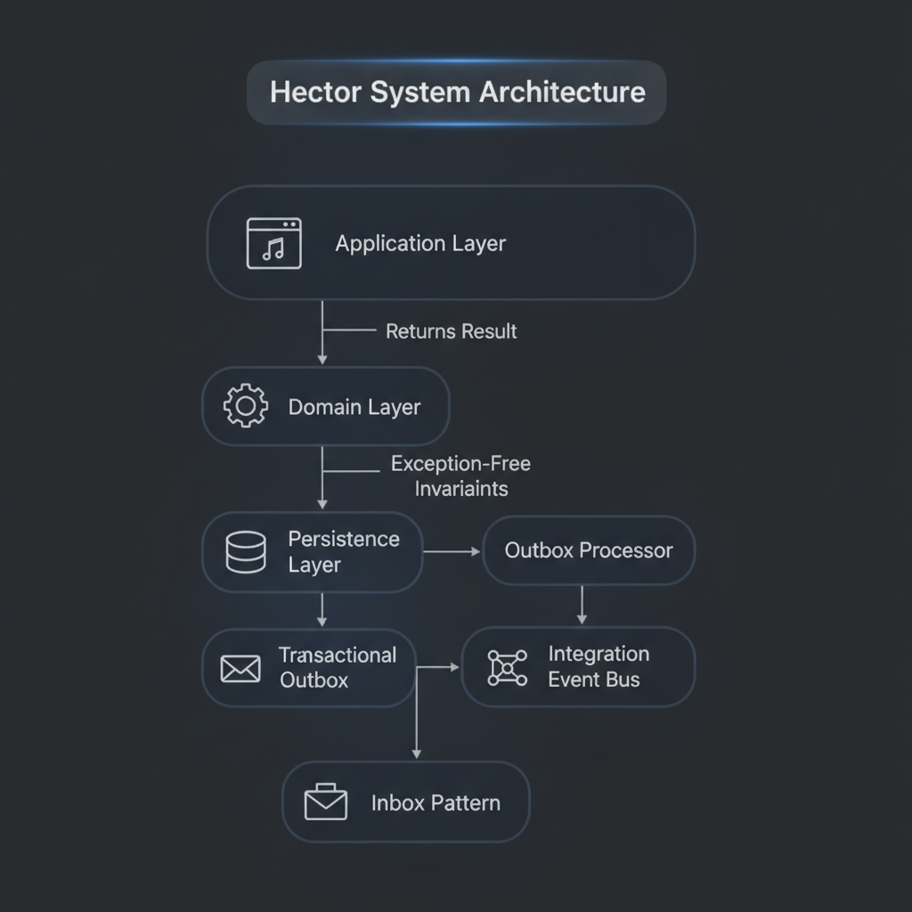

# 🚀 v1.1.0 — Result-Based Architecture

We have officially migrated from an **exception-driven flow** to a **functional Result pattern**. This shift ensures that domain invariants and application failures are handled as first-class citizens, making the system more predictable, testable, and robust.

### ✨ What's New

* **Predictable APIs:** All command and query handlers now return `Result` or `Result<T>` instead of throwing exceptions.
* **Standardized Errors:** A centralized error taxonomy (Validation, NotFound, Conflict, BusinessRule) ensures consistent error reporting across all modules.
* **Web Integration:** Automatic mapping of Result objects to appropriate HTTP status codes via `ResultEndpointFilter`.

### 🏗️ Architecture Overview

<p align="center">
  
</p>

### 📦 Core Building Blocks Enhancements

#### `BuildingBlocks.Application`

* **`Result` & `Result<T>`**: Canonical response types for all application operations.

* **Error & ErrorCategory**: Rich error objects covering `Validation`, `NotFound`, `Conflict`, `BusinessRule`, etc.
* **Messaging**: `ICommand`, `IQuery`, and `IMediator` with built-in Result support.

#### `BuildingBlocks.Domain`

* **Identity**: Enhanced `StronglyTypedId` to eliminate primitive obsession.

* **Invariants**: `Ensure` guard pattern for domain integrity without throwing exceptions for business logic.

### 💻 Code Example: Result-Oriented Handler

In **Hector**, we now handle business logic failures gracefully:

```csharp
public async Task<Result<ProjectId>> Handle(CreateProjectCommand request, CancellationToken ct)
{
    if (await _repository.ExistsAsync(request.Name))
    {
        return Result.Failure<ProjectId>(ProjectErrors.NameAlreadyExists);
    }

    var project = Project.Create(request.Name);
    await _repository.AddAsync(project);

    return Result.Success(project.Id);
}
```

### 🛡️ Testing Strategy: Architecture Guard Rails

We've introduced strict **Architecture Tests** to ensure the new pattern is followed:

* **ResultRules**: Guarantees all handlers return `Result` types.
* **LayerRules**: Enforces that Domain remains pure and independent.
* **ErrorContractTests**: Validates error code naming conventions.

### 📜 New Architectural Decisions (ADRs)

* **ADR-0047**: Standardize Result Pattern

* **ADR-0048**: Adopt Result-based Validation Handling
* **ADR-0049**: Adopt Result-based Query Responses
* **ADR-0050**: Establish Application Error Taxonomy
* **ADR-0051**: Define Allowed Error Categories
